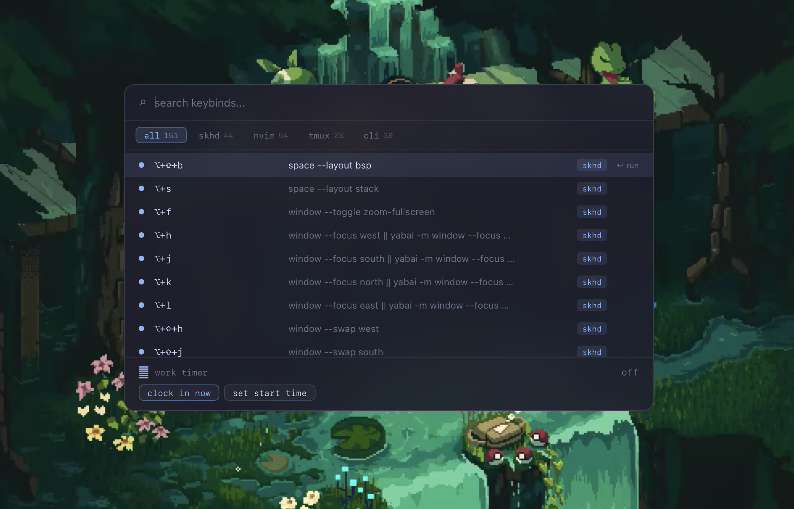

# keybind-hud

A searchable keybinding overlay for macOS, built with Tauri and React. Hit `⌥+/` anywhere to bring it up — search across all your tools, run commands, or copy a binding to the clipboard without leaving the keyboard.



## What it does

The HUD aggregates keybindings from your config files and presents them in a single searchable list. It parses your actual dotfiles live, so it stays in sync as you change things. If a parser fails, it falls back to a hardcoded set of sane defaults.

Sources it reads:

- **skhd** — `~/.skhdrc`
- **neovim** — `~/.config/nvim/lua/config/keymaps.lua` and plugin files under `~/.config/nvim/lua/plugins/`
- **tmux** — `~/.config/tmux/tmux.conf`
- **zellij** — `~/.config/zellij/config.kdl`
- **CLI tools** — hardcoded reference list (eza, bat, fzf, lazygit, etc.)

You can switch between tmux and zellij from the system tray — the HUD will show the right set of multiplexer bindings.

## Usage

| Key | Action |
|---|---|
| `⌥+/` | Toggle the HUD |
| Type | Filter by key, description, or tag |
| `Tab` | Cycle category filter (all → skhd → nvim → tmux/zellij → cli) |
| `↑/↓` or `j/k` | Navigate results |
| `Enter` | Run command (skhd entries) or copy key to clipboard |
| `Escape` | Clear search, or close if already empty |

skhd entries have a runnable command attached — selecting one executes it directly. Everything else copies the key string to the clipboard.

## Work timer

The HUD has a built-in work timer at the bottom of the panel. It tracks a 7h45m workday and shows time remaining (or overtime). Clock in with the button or via the skhd binding `⌥+⇧+W`, set a custom start time if you forgot to clock in, and clock out when done.

## Setup

Requires Rust and Node/pnpm.

```sh
git clone https://github.com/sicazo/keybind-hud
cd keybind-hud
pnpm install
pnpm tauri build
```

Move the built `.app` to `/Applications`. It registers a launch agent on first run so it starts automatically on login. The global shortcut `⌥+/` is registered system-wide — no need to keep it focused.

The system tray icon lets you switch the multiplexer preference between tmux and zellij. Config is saved to `~/.config/keybind-hud/config.json`.

## Dev

```sh
pnpm tauri dev
```

Parsers live in `src-tauri/src/parsers/`. Each tool has its own file. To add a new source, implement a `parse(path: &str) -> Result<Vec<Entry>>` function and call it from `parsers/mod.rs`.
